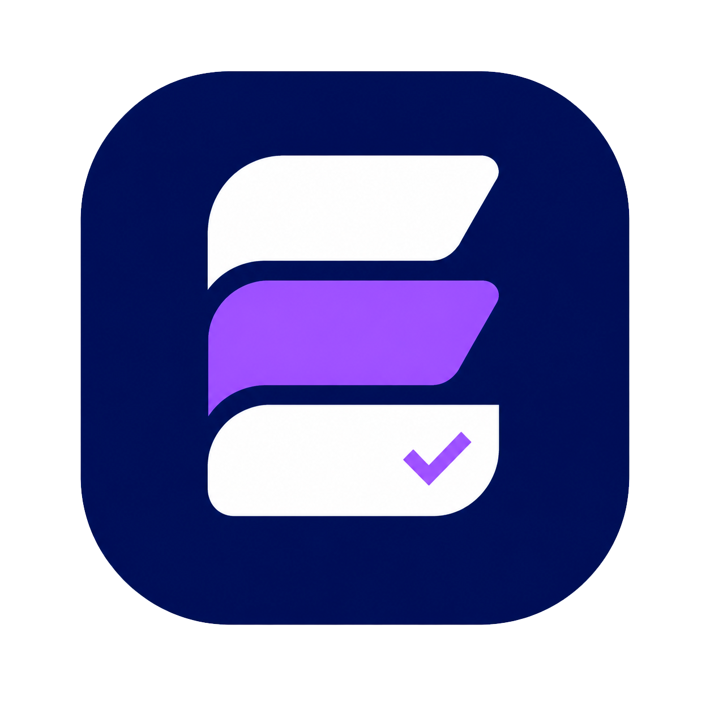

<p align="center">
  
</p>

<h1 align="center">Escoply</h1>

<p align="center">
  <strong>Do briefing à entrega, tudo no controle.</strong>
</p>

<p align="center">
  Escoply é um aplicativo mobile para freelancers organizarem clientes, projetos, escopos, orçamentos, aprovações, materiais, prazos, lembretes e obrigações recorrentes em um só lugar.
</p>

<p align="center">
  
  
  
  
  
</p>

---

## Sumário

- [Sobre o projeto](#sobre-o-projeto)
- [Motivação](#motivação)
- [Problema](#problema)
- [Solução](#solução)
- [Público-alvo](#público-alvo)
- [Proposta de valor](#proposta-de-valor)
- [Fluxo principal do produto](#fluxo-principal-do-produto)
- [Funcionalidades](#funcionalidades)
- [Telas planejadas](#telas-planejadas)
- [Design e identidade visual](#design-e-identidade-visual)
- [Paleta de cores](#paleta-de-cores)
- [Direção de UI/UX](#direção-de-uiux)
- [Componentes planejados](#componentes-planejados)
- [Stack](#stack)
- [Arquitetura](#arquitetura)
- [Back-end e banco de dados](#back-end-e-banco-de-dados)
- [Supabase e segurança](#supabase-e-segurança)
- [Entidades principais](#entidades-principais)
- [Estrutura de pastas](#estrutura-de-pastas)
- [Roadmap](#roadmap)
- [Como rodar o projeto](#como-rodar-o-projeto)
- [Variáveis de ambiente](#variáveis-de-ambiente)
- [Scripts](#scripts)
- [Padrões de código](#padrões-de-código)
- [Status do projeto](#status-do-projeto)
- [Aprendizados esperados](#aprendizados-esperados)
- [Futuras ideias](#futuras-ideias)
- [Autor](#autor)
- [Licença](#licença)

---

## Sobre o projeto

O **Escoply** é um aplicativo mobile desenvolvido com **React Native**, **Expo** e **TypeScript**, criado para ajudar freelancers a centralizarem a gestão dos seus trabalhos.

A proposta do aplicativo é organizar, em um único lugar, tudo aquilo que normalmente fica espalhado entre conversas, arquivos, anotações, planilhas e memória.

O app permite que o freelancer gerencie:

- clientes;
- projetos;
- escopos;
- orçamentos;
- aprovações;
- materiais;
- prazos;
- lembretes;
- cobranças;
- obrigações recorrentes;
- histórico de cada cliente/projeto.

O objetivo é construir uma solução mobile-first que ajude profissionais autônomos a terem mais clareza sobre o andamento dos seus projetos, reduzindo perda de prazos, retrabalho e confusão sobre o que foi combinado com cada cliente.

---

## Motivação

O Escoply nasceu a partir de uma dor real.

Freelancers geralmente precisam lidar com muitos detalhes ao mesmo tempo:

- cliente novo pedindo orçamento;
- projeto em andamento;
- escopo que precisa ser lembrado;
- material enviado pelo cliente;
- aprovação pendente;
- cobrança atrasada;
- prazo de entrega próximo;
- obrigação mensal, como o DAS MEI.

Muitas vezes essas informações ficam espalhadas em locais diferentes:

```txt
WhatsApp
Google Drive
Bloco de notas
E-mail
Planilhas
Prints
Conversas antigas
Memória
```

Com isso, é fácil perder algum detalhe importante.

O Escoply busca resolver essa desorganização criando uma central única para acompanhar o fluxo completo do trabalho freelance: do briefing até a entrega.

---

## Problema

Freelancers normalmente não precisam apenas de uma lista de tarefas. Eles precisam organizar um fluxo maior, que envolve relacionamento com clientes, negociação, escopo, entrega e pagamento.

Algumas dores comuns:

- esquecer prazo de entrega;
- esquecer de cobrar cliente;
- não lembrar exatamente o que foi combinado;
- perder materiais enviados pelo cliente;
- ter dificuldade para acompanhar múltiplos projetos;
- não saber quais orçamentos foram enviados ou aprovados;
- não saber quanto ainda tem a receber;
- não ter histórico organizado por cliente;
- esquecer obrigações recorrentes, como pagamento do MEI;
- misturar informações entre clientes diferentes;
- depender demais de mensagens antigas no WhatsApp.

Esses problemas geram retrabalho, atraso, perda de confiança e dificuldade para escalar a rotina como freelancer.

---

## Solução

O **Escoply** centraliza as principais informações de um freelancer em uma experiência simples e visual.

A proposta é permitir que o usuário abra o aplicativo e consiga responder rapidamente:

- O que preciso fazer hoje?
- Quais projetos estão em andamento?
- Quais prazos estão próximos?
- Quais clientes estão ativos?
- Quais orçamentos estão pendentes?
- Quais entregas dependem de aprovação?
- Quanto tenho a receber?
- O que foi combinado no escopo?
- Quais materiais pertencem a cada projeto?
- O DAS MEI deste mês já foi pago?

O aplicativo será construído em fases, começando por um MVP funcional e evoluindo para recursos mais avançados, como PDF, upload de arquivos, notificações e link público de aprovação.

---

## Público-alvo

O Escoply foi pensado para profissionais freelancers, autônomos e prestadores de serviço que trabalham por projeto.

Exemplos de público:

- desenvolvedores freelancers;
- designers gráficos;
- designers de UI/UX;
- social medias;
- editores de vídeo;
- fotógrafos;
- gestores de tráfego;
- criadores de sites;
- copywriters;
- consultores;
- MEIs;
- profissionais de marketing;
- profissionais criativos;
- pequenos prestadores de serviço digitais.

### Persona principal

**Freelancer solo que atende múltiplos clientes ao mesmo tempo.**

Esse usuário precisa controlar:

- quem são seus clientes;
- quais projetos estão ativos;
- qual escopo foi combinado;
- quais prazos precisam ser cumpridos;
- quais materiais foram enviados;
- quais orçamentos foram aprovados;
- quais pagamentos ainda estão pendentes;
- quais lembretes são importantes para hoje.

---

## Proposta de valor

O Escoply não é apenas um app de tarefas. Ele é uma central de controle para o fluxo de trabalho freelance.

### Frase principal

> Do briefing à entrega, tudo no controle.

### Valor entregue

Com o Escoply, o freelancer pode:

- organizar clientes e projetos em um só lugar;
- controlar o escopo combinado;
- acompanhar status de projetos;
- registrar orçamentos;
- acompanhar aprovações;
- criar lembretes importantes;
- controlar obrigações recorrentes;
- centralizar materiais;
- visualizar prazos e pendências no dashboard.

### Diferencial

O diferencial do Escoply está em organizar o trabalho freelance por relacionamento e projeto, não apenas por tarefas soltas.

---

## Fluxo principal do produto

O fluxo principal segue a jornada natural de um trabalho freelance:

```txt
Cliente → Projeto → Escopo → Orçamento → Aprovação → Entrega → Pagamento
```

### Exemplo de uso

1. O freelancer cadastra um novo cliente.
2. Cria um projeto vinculado a esse cliente.
3. Define o escopo do projeto.
4. Registra o orçamento.
5. Marca o orçamento como enviado.
6. Atualiza o status para aprovado.
7. Adiciona materiais enviados pelo cliente.
8. Cria lembretes de prazo, cobrança ou follow-up.
9. Acompanha o andamento pelo dashboard.
10. Finaliza o projeto e registra o pagamento.

---

## Funcionalidades

### MVP

A primeira versão do Escoply deve focar no núcleo do produto.

Funcionalidades planejadas para o MVP:

- autenticação de usuário;
- dashboard inicial;
- cadastro de clientes;
- listagem de clientes;
- edição de clientes;
- detalhe do cliente;
- cadastro de projetos;
- projetos vinculados a clientes;
- status de projeto;
- controle de prazo;
- controle de valor estimado;
- criação de itens de escopo;
- marcação de escopo como concluído;
- cadastro de orçamento simples;
- status de orçamento;
- criação de lembretes;
- lembretes vinculados a cliente ou projeto;
- obrigações recorrentes, como DAS MEI;
- dados salvos online com Supabase.

### Funcionalidades intermediárias

Depois do MVP, o app pode evoluir com:

- upload de imagens;
- upload de arquivos;
- materiais vinculados a projetos;
- links e notas por projeto;
- notificações locais;
- integração com WhatsApp;
- busca global;
- filtros por status;
- dashboard financeiro;
- tela de atividades recentes;
- geração de PDF simples.

### Funcionalidades avançadas

Em versões futuras:

- PDF de orçamento;
- PDF de escopo;
- PDF de recibo;
- link público para aprovação;
- área do cliente;
- assinatura digital simples;
- relatórios financeiros;
- sincronização avançada;
- versão web;
- plano gratuito e plano pago;
- integração com calendário;
- envio de e-mails;
- automações de lembrete.

---

## Telas planejadas

### Auth

Telas relacionadas à autenticação.

- Login
- Cadastro
- Recuperação de senha futuramente

### Dashboard

Tela inicial do app.

Deve mostrar:

- saudação ao usuário;
- quantidade de clientes ativos;
- quantidade de projetos em andamento;
- prazos próximos;
- lembretes de hoje;
- valor total a receber;
- orçamentos pendentes;
- obrigação MEI do mês;
- próximos projetos com prazo.

O dashboard deve responder:

```txt
O que preciso fazer hoje?
Quais projetos estão perto do prazo?
Quem preciso cobrar?
Quanto tenho a receber?
O MEI deste mês está pago?
```

### Clientes

Tela para gerenciamento de clientes.

Funcionalidades:

- listar clientes;
- buscar cliente;
- filtrar por status;
- criar cliente;
- editar cliente;
- excluir cliente;
- abrir detalhe do cliente.

### Detalhe do cliente

Tela com informações completas do cliente.

Deve mostrar:

- nome;
- telefone;
- e-mail;
- empresa;
- Instagram;
- site;
- observações;
- status;
- projetos vinculados;
- orçamentos;
- lembretes;
- histórico;
- botão para abrir WhatsApp futuramente.

### Projetos

Tela de listagem de projetos.

Funcionalidades:

- listar projetos;
- buscar projeto;
- filtrar por status;
- ordenar por prazo;
- criar projeto;
- editar projeto;
- excluir projeto;
- visualizar detalhe.

### Detalhe do projeto

Uma das telas mais importantes do app.

Deve mostrar:

- título;
- cliente vinculado;
- descrição;
- status;
- prazo;
- valor estimado;
- progresso do escopo;
- orçamento;
- aprovações;
- materiais;
- lembretes;
- ações rápidas.

### Escopo

Controle do que foi combinado com o cliente.

Funcionalidades:

- adicionar item de escopo;
- editar item;
- remover item;
- marcar como concluído;
- mostrar progresso total.

Exemplo:

```txt
[x] Landing page
[x] Formulário de contato
[ ] Responsividade mobile
[ ] Deploy final
```

### Orçamentos

Controle financeiro inicial do projeto.

Funcionalidades:

- criar orçamento;
- editar orçamento;
- definir valor;
- definir validade;
- definir condições de pagamento;
- marcar como rascunho;
- marcar como enviado;
- marcar como aprovado;
- marcar como recusado.

### Aprovações

Controle de aprovações importantes.

Exemplos:

- aprovação de orçamento;
- aprovação de escopo;
- aprovação de layout;
- aprovação de entrega final.

Funcionalidades:

- criar aprovação;
- marcar como pendente;
- marcar como aprovada;
- marcar como recusada;
- adicionar observações;
- gerar link público futuramente.

### Materiais

Central de materiais do projeto.

Funcionalidades planejadas:

- adicionar link;
- adicionar nota;
- adicionar imagem;
- adicionar arquivo;
- abrir material;
- remover material;
- salvar no Supabase Storage futuramente.

### Lembretes

Tela para controle de tarefas e prazos.

Divisões:

- Hoje
- Atrasados
- Esta semana
- Próximos
- Concluídos

Tipos de lembrete:

- Projeto
- Pagamento
- MEI
- Follow-up
- Geral

### Obrigações

Tela para obrigações recorrentes.

Exemplos:

- pagar DAS MEI;
- emitir nota fiscal;
- pagar hospedagem;
- renovar domínio;
- pagar ferramenta mensal.

### Configurações

Tela com preferências e informações da conta.

Opções planejadas:

- dados do usuário;
- tema futuramente;
- backup futuramente;
- sobre o app;
- versão;
- sair da conta.

---

## Design e identidade visual

### Nome

**Escoply**

### Slogan

> Do briefing à entrega, tudo no controle.

### Conceito da marca

A identidade do Escoply foi pensada para transmitir:

- organização;
- clareza;
- confiança;
- produtividade;
- controle;
- modernidade;
- criatividade;
- profissionalismo.

A logo possui:

- ícone arredondado azul-marinho;
- símbolo interno em formato de `E`;
- camadas representando etapas do projeto;
- faixa roxa representando fluxo;
- check representando aprovação ou conclusão.

### Significado visual

```txt
E        → Escoply
Camadas  → etapas do projeto
Check    → aprovação/conclusão
Azul     → confiança e organização
Roxo     → criatividade e tecnologia
```

---

## Paleta de cores

| Uso             | Nome             | Hex       |
| --------------- | ---------------- | --------- |
| Primary         | Azul-marinho     | `#071E63` |
| Primary Dark    | Azul escuro      | `#041342` |
| Primary Light   | Azul claro       | `#123A9C` |
| Secondary       | Roxo             | `#8B5CF6` |
| Secondary Dark  | Roxo escuro      | `#6D28D9` |
| Secondary Light | Roxo claro       | `#A78BFA` |
| Background      | Fundo claro      | `#F8FAFC` |
| Surface         | Cards            | `#FFFFFF` |
| Surface Muted   | Fundo secundário | `#F1F5F9` |
| Text            | Texto principal  | `#0F172A` |
| Text Muted      | Texto secundário | `#64748B` |
| Text Light      | Texto claro      | `#94A3B8` |
| Border          | Bordas           | `#E2E8F0` |
| Success         | Sucesso          | `#22C55E` |
| Warning         | Atenção          | `#F59E0B` |
| Danger          | Erro             | `#EF4444` |
| Info            | Informação       | `#3B82F6` |

### Arquivo sugerido

```ts
export const colors = {
  primary: "#071E63",
  primaryDark: "#041342",
  primaryLight: "#123A9C",

  secondary: "#8B5CF6",
  secondaryDark: "#6D28D9",
  secondaryLight: "#A78BFA",

  background: "#F8FAFC",
  surface: "#FFFFFF",
  surfaceMuted: "#F1F5F9",

  text: "#0F172A",
  textMuted: "#64748B",
  textLight: "#94A3B8",

  border: "#E2E8F0",

  success: "#22C55E",
  warning: "#F59E0B",
  danger: "#EF4444",
  info: "#3B82F6",
};
```

---

## Direção de UI/UX

O design do Escoply deve ser:

- limpo;
- moderno;
- mobile-first;
- baseado em cards;
- com bastante espaçamento;
- com cantos arredondados;
- com sombras leves;
- com ícones simples;
- com hierarquia visual forte;
- com linguagem clara;
- com foco em produtividade;
- fácil de entender rapidamente.

### Sensação desejada

O usuário deve sentir:

```txt
“Abri o app e já sei exatamente o que preciso fazer hoje.”
```

### Princípios de experiência

1. **Clareza acima de complexidade**  
   Cada tela deve ter uma ação principal clara.

2. **Informação agrupada por contexto**  
   Dados de cliente devem ficar no cliente. Dados de projeto devem ficar no projeto.

3. **Dashboard útil**  
   A tela inicial precisa mostrar o que importa agora.

4. **Poucos passos para registrar algo**  
   Criar cliente, projeto ou lembrete deve ser rápido.

5. **Visual consistente**  
   Componentes reutilizáveis devem manter o mesmo padrão.

---

## Componentes planejados

### Componentes base

```txt
Button
Input
Card
Badge
Header
EmptyState
Screen
SectionTitle
FloatingButton
Modal
Select
DatePicker
StatusBadge
```

### Componentes de domínio

```txt
ClientCard
ClientForm
ProjectCard
ProjectForm
ProjectStatusBadge
ScopeItemCard
BudgetCard
BudgetForm
ReminderCard
ReminderForm
DashboardMetricCard
ObligationCard
AssetCard
ApprovalCard
```

### Botão primário

```txt
Fundo: #071E63
Texto: #FFFFFF
Border radius: 14px
Altura: 48px
Peso da fonte: 600
```

### Botão secundário

```txt
Fundo: #EDE9FE
Texto: #6D28D9
Border radius: 14px
Altura: 48px
Peso da fonte: 600
```

### Card

```txt
Fundo: #FFFFFF
Border: #E2E8F0
Border radius: 18px
Padding: 16px
Shadow: leve
```

### Input

```txt
Altura: 48px
Border: #E2E8F0
Radius: 14px
Fundo: #FFFFFF
Texto: #0F172A
Placeholder: #94A3B8
```

### Badge

```txt
Padding horizontal: 10px
Padding vertical: 6px
Border radius: 999px
Fonte: 12px
Peso: 600
```

---

## Stack

### Mobile

- Expo
- React Native
- TypeScript
- Expo Router
- Expo Dev Client futuramente
- NativeWind
- TanStack Query
- Zustand
- React Hook Form
- Zod
- Supabase JS
- AsyncStorage
- date-fns
- Lucide React Native
- Expo Image Picker
- Expo Document Picker
- Expo File System
- Expo Sharing
- Expo Linking
- Expo Notifications

### Estado e dados

- **TanStack Query** para dados remotos;
- **Zustand** para estado local/global simples;
- **React Hook Form** para formulários;
- **Zod** para validação;
- **Supabase JS** para comunicação com Auth, Database e Storage.

### Back-end e banco

- Supabase Auth
- Supabase Postgres
- Supabase Storage
- Supabase Row Level Security
- Node.js futuramente
- Fastify futuramente
- Supabase Admin futuramente

### Deploy planejado

- Mobile: Expo / EAS Build
- Database/Auth/Storage: Supabase
- API Node: Render
- Código: GitHub

---

## Arquitetura

Arquitetura planejada:

```txt
App Expo → Supabase
App Expo → Node API → Supabase Admin
```

### Comunicação direta com Supabase

O app mobile se comunica diretamente com o Supabase para:

- autenticação;
- banco de dados;
- storage;
- operações comuns;
- CRUD principal.

Exemplos:

- criar cliente;
- listar projetos;
- criar escopo;
- editar orçamento;
- listar lembretes.

### Comunicação com Node API

A API Node será usada para ações sensíveis ou específicas:

- geração de PDF;
- criação de links públicos de aprovação;
- envio de e-mails;
- webhooks;
- relatórios;
- regras de negócio protegidas.

### Diagrama

```txt
┌──────────────────────┐
│     Expo Mobile      │
│ React Native + TS    │
└──────────┬───────────┘
           │
           │ CRUD / Auth / Storage
           ▼
┌──────────────────────┐
│      Supabase        │
│ Auth / DB / Storage  │
│ RLS / Postgres       │
└──────────────────────┘

┌──────────────────────┐
│     Expo Mobile      │
└──────────┬───────────┘
           │ PDF / Links / E-mail
           ▼
┌──────────────────────┐
│      Node API        │
│ Fastify + TS         │
└──────────┬───────────┘
           │ Admin actions
           ▼
┌──────────────────────┐
│   Supabase Admin     │
└──────────────────────┘
```

---

## Back-end e banco de dados

O projeto começa com o Supabase como back-end principal.

O Supabase será responsável por:

- autenticação;
- banco de dados relacional;
- storage;
- regras de acesso por usuário;
- persistência dos dados online.

A API Node será adicionada depois para recursos avançados.

### Por que não usar Node para tudo?

O CRUD comum pode ser feito direto pelo app usando Supabase com RLS.

Isso reduz complexidade inicial e permite que o projeto avance mais rápido.

A API Node entra onde existe necessidade de:

- proteger uma chave sensível;
- executar lógica privada;
- gerar arquivo;
- enviar e-mail;
- processar webhook;
- criar token público;
- fazer ação administrativa.

---

## Supabase e segurança

### Regras principais

Todas as tabelas com dados do usuário devem ter `user_id`.

A regra base é:

```sql
auth.uid() = user_id
```

Isso garante que cada usuário só acesse seus próprios dados.

### Chaves

No app mobile, usar somente:

```env
EXPO_PUBLIC_SUPABASE_URL=
EXPO_PUBLIC_SUPABASE_ANON_KEY=
```

Na API Node, usar:

```env
SUPABASE_URL=
SUPABASE_SERVICE_ROLE_KEY=
```

### Regra importante

A `SUPABASE_SERVICE_ROLE_KEY` nunca deve ser usada no app mobile.

Ela só pode existir no back-end Node.

### Tabelas planejadas

```txt
profiles
clients
projects
scope_items
budgets
approvals
project_assets
reminders
obligations
```

### Relacionamento geral

```txt
profiles
  └── clients
        └── projects
              ├── scope_items
              ├── budgets
              ├── approvals
              ├── project_assets
              └── reminders

profiles
  └── obligations
```

---

## Entidades principais

### Client

Representa um cliente do freelancer.

```ts
export type ClientStatus = "prospect" | "active" | "inactive";

export type Client = {
  id: string;
  userId: string;
  name: string;
  phone?: string;
  email?: string;
  company?: string;
  document?: string;
  instagram?: string;
  website?: string;
  notes?: string;
  status: ClientStatus;
  createdAt: string;
  updatedAt: string;
};
```

### Project

Representa um projeto vinculado a um cliente.

```ts
export type ProjectStatus =
  | "briefing"
  | "budget"
  | "approved"
  | "in_progress"
  | "review"
  | "done"
  | "canceled";

export type Project = {
  id: string;
  userId: string;
  clientId: string;
  title: string;
  description?: string;
  status: ProjectStatus;
  startDate?: string;
  deadline?: string;
  budgetValue?: number;
  createdAt: string;
  updatedAt: string;
};
```

### ScopeItem

Representa um item do escopo de um projeto.

```ts
export type ScopeItem = {
  id: string;
  userId: string;
  projectId: string;
  title: string;
  description?: string;
  isDone: boolean;
  createdAt: string;
  updatedAt: string;
};
```

### Budget

Representa um orçamento vinculado a um projeto.

```ts
export type BudgetStatus = "draft" | "sent" | "approved" | "rejected";

export type Budget = {
  id: string;
  userId: string;
  projectId: string;
  title: string;
  description?: string;
  value: number;
  status: BudgetStatus;
  paymentTerms?: string;
  validUntil?: string;
  approvedAt?: string;
  createdAt: string;
  updatedAt: string;
};
```

### Approval

Representa uma aprovação de etapa, escopo, orçamento ou entrega.

```ts
export type ApprovalStatus = "pending" | "approved" | "rejected";

export type Approval = {
  id: string;
  userId: string;
  projectId: string;
  title: string;
  description?: string;
  status: ApprovalStatus;
  approvedAt?: string;
  notes?: string;
  publicToken?: string;
  createdAt: string;
  updatedAt: string;
};
```

### ProjectAsset

Representa um material ou anexo do projeto.

```ts
export type ProjectAssetType = "image" | "file" | "link" | "note";

export type ProjectAsset = {
  id: string;
  userId: string;
  projectId: string;
  type: ProjectAssetType;
  title: string;
  uri?: string;
  storagePath?: string;
  description?: string;
  createdAt: string;
  updatedAt: string;
};
```

### Reminder

Representa um lembrete.

```ts
export type ReminderType =
  | "project"
  | "payment"
  | "mei"
  | "follow_up"
  | "general";

export type Reminder = {
  id: string;
  userId: string;
  title: string;
  description?: string;
  date: string;
  type: ReminderType;
  clientId?: string;
  projectId?: string;
  isDone: boolean;
  createdAt: string;
  updatedAt: string;
};
```

### Obligation

Representa uma obrigação recorrente.

```ts
export type ObligationRecurrence = "monthly" | "weekly" | "yearly" | "custom";

export type Obligation = {
  id: string;
  userId: string;
  title: string;
  description?: string;
  recurrence: ObligationRecurrence;
  dayOfMonth?: number;
  isActive: boolean;
  createdAt: string;
  updatedAt: string;
};
```

---

## Estrutura de pastas

Estrutura planejada para o app mobile:

```txt
escoply-mobile/
  app/
    _layout.tsx
    index.tsx

    auth/
      login.tsx
      register.tsx

    clients/
      index.tsx
      create.tsx
      [id].tsx
      edit/
        [id].tsx

    projects/
      index.tsx
      create.tsx
      [id].tsx
      edit/
        [id].tsx

    reminders/
      index.tsx
      create.tsx

    obligations/
      index.tsx
      create.tsx

    settings/
      index.tsx

  src/
    components/
      ui/
        Button.tsx
        Input.tsx
        Card.tsx
        Badge.tsx
        Header.tsx
        EmptyState.tsx
        Screen.tsx
        SectionTitle.tsx
        FloatingButton.tsx

      clients/
        ClientCard.tsx
        ClientForm.tsx

      projects/
        ProjectCard.tsx
        ProjectForm.tsx
        ProjectStatusBadge.tsx
        ScopeItem.tsx

      budgets/
        BudgetCard.tsx
        BudgetForm.tsx

      reminders/
        ReminderCard.tsx
        ReminderForm.tsx

    features/
      clients/
        client.types.ts
        client.schema.ts
        client.service.ts
        client.queries.ts

      projects/
        project.types.ts
        project.schema.ts
        project.service.ts
        project.queries.ts

      scope/
        scope.types.ts
        scope.schema.ts
        scope.service.ts
        scope.queries.ts

      budgets/
        budget.types.ts
        budget.schema.ts
        budget.service.ts
        budget.queries.ts

      reminders/
        reminder.types.ts
        reminder.schema.ts
        reminder.service.ts
        reminder.queries.ts

      obligations/
        obligation.types.ts
        obligation.schema.ts
        obligation.service.ts
        obligation.queries.ts

    lib/
      supabase.ts
      query-client.ts

    constants/
      colors.ts
      status.ts
      routes.ts

    utils/
      dates.ts
      currency.ts
      phone.ts
      whatsapp.ts
      ids.ts

    hooks/
      useAuth.ts
      useClients.ts
      useProjects.ts
      useReminders.ts

    assets/
      images/
      icons/
```

---

## Roadmap

### Fase 1 — Setup do app

- [ ] Criar projeto Expo
- [ ] Configurar TypeScript
- [ ] Configurar Expo Router
- [ ] Configurar NativeWind
- [ ] Criar paleta de cores
- [ ] Criar estrutura base de pastas
- [ ] Adicionar logo e ícone
- [ ] Criar dashboard mockado

### Fase 2 — Supabase

- [ ] Criar projeto no Supabase
- [ ] Configurar Auth
- [ ] Criar tabelas principais
- [ ] Ativar RLS
- [ ] Criar policies por `user_id`
- [ ] Conectar app ao Supabase

### Fase 3 — Autenticação

- [ ] Tela de login
- [ ] Tela de cadastro
- [ ] Persistência de sessão
- [ ] Logout
- [ ] Proteção de rotas

### Fase 4 — Clientes

- [ ] Listar clientes
- [ ] Criar cliente
- [ ] Editar cliente
- [ ] Excluir cliente
- [ ] Detalhe do cliente
- [ ] Buscar cliente
- [ ] Filtrar por status

### Fase 5 — Projetos

- [ ] Listar projetos
- [ ] Criar projeto vinculado a cliente
- [ ] Editar projeto
- [ ] Excluir projeto
- [ ] Detalhe do projeto
- [ ] Status do projeto
- [ ] Prazo e valor estimado

### Fase 6 — Escopo

- [ ] Criar itens de escopo
- [ ] Editar item de escopo
- [ ] Marcar item como concluído
- [ ] Excluir item de escopo
- [ ] Mostrar progresso do escopo

### Fase 7 — Orçamentos

- [ ] Criar orçamento
- [ ] Editar orçamento
- [ ] Definir valor
- [ ] Definir validade
- [ ] Definir condições de pagamento
- [ ] Controlar status do orçamento

### Fase 8 — Aprovações

- [ ] Criar aprovação
- [ ] Marcar como aprovada
- [ ] Marcar como recusada
- [ ] Marcar como pendente
- [ ] Adicionar observações
- [ ] Criar link público futuramente

### Fase 9 — Lembretes e obrigações

- [ ] Criar lembretes
- [ ] Vincular lembrete a cliente/projeto
- [ ] Listar lembretes de hoje
- [ ] Listar lembretes atrasados
- [ ] Criar obrigação DAS MEI
- [ ] Mostrar obrigações no dashboard

### Fase 10 — Materiais

- [ ] Upload de imagem
- [ ] Upload de arquivo
- [ ] Adicionar links
- [ ] Adicionar notas
- [ ] Salvar materiais no Supabase Storage

### Fase 11 — API Node

- [ ] Criar projeto Node/Fastify
- [ ] Criar rota `/health`
- [ ] Configurar Supabase Admin
- [ ] Fazer deploy da API
- [ ] Conectar app mobile à API

### Fase 12 — Features avançadas

- [ ] Gerar PDF de orçamento
- [ ] Gerar PDF de escopo
- [ ] Criar link público de aprovação
- [ ] Enviar e-mail futuramente

### Fase 13 — Polimento

- [ ] Criar splash screen
- [ ] Configurar ícone do app
- [ ] Melhorar estados vazios
- [ ] Melhorar loading states
- [ ] Melhorar mensagens de erro
- [ ] Revisar responsividade
- [ ] Criar screenshots
- [ ] Criar vídeo de demonstração
- [ ] Gerar build com EAS

---

## Como rodar o projeto

Clone o repositório:

```bash
git clone https://github.com/seu-usuario/escoply-mobile.git
```

Entre na pasta:

```bash
cd escoply-mobile
```

Instale as dependências:

```bash
npm install
```

Crie um arquivo `.env` na raiz do projeto:

```env
EXPO_PUBLIC_SUPABASE_URL=
EXPO_PUBLIC_SUPABASE_ANON_KEY=
EXPO_PUBLIC_API_URL=
```

Inicie o projeto:

```bash
npx expo start
```

---

## Variáveis de ambiente

### Mobile

```env
EXPO_PUBLIC_SUPABASE_URL=
EXPO_PUBLIC_SUPABASE_ANON_KEY=
EXPO_PUBLIC_API_URL=
```

### API Node futuramente

```env
SUPABASE_URL=
SUPABASE_SERVICE_ROLE_KEY=
NODE_ENV=
PORT=
```

---

## Scripts

Iniciar o projeto:

```bash
npm start
```

Rodar no Android:

```bash
npm run android
```

Rodar no iOS:

```bash
npm run ios
```

Rodar na web:

```bash
npm run web
```

---

## Padrões de código

### TypeScript

O projeto deve evitar `any` sempre que possível.

### Separação de responsabilidades

Componentes não devem conter regra de negócio pesada.

Chamadas ao Supabase/API devem ficar em arquivos de service.

Validações devem ficar em schemas Zod.

Dados remotos devem ser gerenciados com TanStack Query.

Estado local simples deve usar Zustand.

### Nomes de arquivos

Padrão sugerido:

```txt
client.types.ts
client.schema.ts
client.service.ts
client.queries.ts
ClientCard.tsx
ClientForm.tsx
```

### Nomes de variáveis

Usar `camelCase` no código:

```ts
clientId;
projectId;
createdAt;
updatedAt;
budgetValue;
```

### Nomes no banco

Usar `snake_case` no Supabase:

```txt
user_id
client_id
project_id
created_at
updated_at
budget_value
scope_items
project_assets
```

---

## Status do projeto

🚧 **Em desenvolvimento**

Este projeto está sendo construído como estudo prático de React Native, Expo, Supabase e Node.js, com foco em:

- arquitetura;
- design;
- organização de código;
- produto real;
- portfólio profissional.

---

## Aprendizados esperados

Este projeto tem como objetivo praticar:

- React Native com Expo;
- navegação com Expo Router;
- TypeScript em projeto real;
- design system básico;
- criação de componentes reutilizáveis;
- autenticação com Supabase;
- banco Postgres;
- Row Level Security;
- upload de arquivos;
- organização de features;
- gerenciamento de estado;
- validação com Zod;
- formulários com React Hook Form;
- consumo de API;
- criação futura de back-end Node;
- deploy futuro de API;
- estruturação de projeto para portfólio.

---

## Futuras ideias

- Área do cliente
- Aprovação pública por link
- Assinatura digital simples
- Relatórios financeiros
- Integração com calendário
- Notificações push
- Exportação de dados
- Versão web
- Plano gratuito e plano pago futuramente
- Integração com emissão de nota
- Integração com WhatsApp
- Histórico de alterações do projeto
- Templates de orçamento
- Templates de escopo
- Templates de contrato
- Dashboard mensal de faturamento

---

## Autor

Desenvolvido por **Igor Franco**.

GitHub: [@igorviniciusf10](https://github.com/igorviniciusf10)

---

## Licença

Este projeto está em desenvolvimento.

A licença será definida futuramente.
