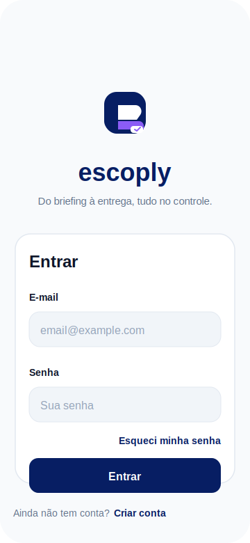
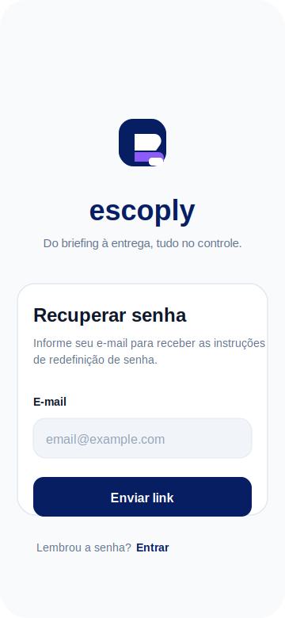
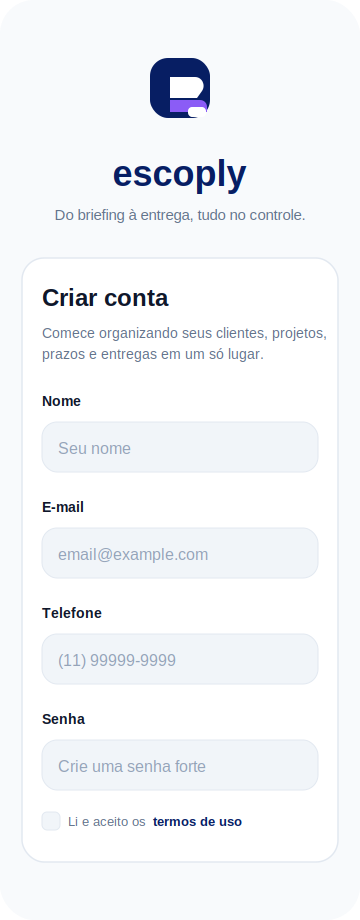

# Escoply

Aplicativo mobile para freelancers organizarem clientes, projetos, escopos, orçamentos, aprovações, materiais, prazos, lembretes e compromissos recorrentes em um só lugar.

> Do briefing à entrega, tudo no controle.

## Screenshots

O Escoply é um app mobile. Por isso, em vez de um link público de acesso, este README mostra as telas principais em formato de preview.

| Login | Recuperar senha | Cadastro |
| --- | --- | --- |
|  |  |  |

## Ideia Geral

O Escoply nasceu para resolver uma dor comum de freelancers: informações importantes ficam espalhadas entre WhatsApp, e-mail, arquivos, planilhas, anotações e memória.

O app centraliza o fluxo do trabalho freelance:

```txt
Cliente -> Projeto -> Escopo -> Orçamento -> Aprovação -> Entrega -> Pagamento
```

## Funcionalidades Planejadas

- Autenticação de usuários.
- Cadastro e gestão de clientes.
- Cadastro e acompanhamento de projetos.
- Checklist de escopo por projeto.
- Orçamentos e status de envio/aprovação.
- Aprovações importantes.
- Materiais e referências.
- Lembretes gerais e lembretes por projeto.
- Obrigações recorrentes.
- Pagamentos e valores a receber.
- Dashboard com resumo do dia.

## Status Atual

Implementado:

- Estrutura base com Expo Router.
- Identidade visual inicial.
- Tela de login.
- Tela de cadastro com:
  - nome;
  - e-mail;
  - telefone;
  - data de nascimento;
  - bloqueio para menores de 16 anos;
  - senha forte;
  - confirmação de senha;
  - aceite de termos de uso em bottom sheet.
- Tela de recuperação de senha.
- Toasts personalizados.
- Guia de padrão do projeto em `AGENTS.md`.

Ainda pendente:

- Integração real com Supabase Auth.
- Banco de dados e policies RLS.
- Dashboard.
- CRUD de clientes e projetos.
- Módulos de escopo, orçamento, aprovações, materiais, lembretes e pagamentos.

## Stack

- Expo
- React Native
- TypeScript
- Expo Router
- NativeWind
- TanStack Query
- Supabase JS
- AsyncStorage
- Expo Vector Icons

## Back-end

A arquitetura planejada usa Supabase como base principal:

```txt
React Native -> Supabase Auth -> Postgres com RLS -> Storage
```

Uso recomendado:

- Supabase Auth para login, cadastro e recuperação de senha.
- Postgres com RLS para dados de usuários, clientes, projetos e tarefas.
- Storage para anexos e materiais.
- Edge Functions apenas para integrações sensíveis, webhooks, notificações e rotinas que exigem `service_role`.

## Estrutura Do Projeto

```txt
app/
  (auth)/
    login.tsx
    register.tsx
    forgot-password.tsx
  _layout.tsx
  index.tsx

src/
  components/
    feedback/
  features/
    auth/
      components/
  hooks/
  lib/
  providers/

constants/
  Colors.ts

docs/
  screenshots/
```

## Design E UX

Direção visual:

- fundo claro;
- cards brancos;
- azul escuro como cor principal;
- bordas suaves;
- sombra discreta;
- formulários limpos;
- feedback visual por toast e bottom sheet;
- fluxo mobile-first.

Paleta principal:

```txt
primary: #071E63
primaryDark: #041342
secondary: #8B5CF6
background: #F8FAFC
surface: #FFFFFF
surfaceMuted: #F1F5F9
text: #0F172A
textMuted: #64748B
border: #E2E8F0
success: #22C55E
warning: #F59E0B
danger: #EF4444
info: #3B82F6
```

## Como Rodar

Instale as dependências:

```bash
npm install
```

Inicie o Expo:

```bash
npx expo start
```

Se estiver com cache antigo:

```bash
npx expo start -c
```

Rodar no Android:

```bash
npx expo start --android
```

## Variáveis De Ambiente

Crie ou atualize o arquivo `.env`:

```env
EXPO_PUBLIC_SUPABASE_URL=
EXPO_PUBLIC_SUPABASE_ANON_KEY=
EXPO_PUBLIC_API_URL=
```

## Build Development Android

```bash
npx eas build --profile development --platform android
```

Se for a primeira configuração do EAS:

```bash
npx eas build:configure
```

## Verificações

TypeScript:

```bash
npx tsc --noEmit
```

Expo Doctor:

```bash
npx expo-doctor
```

## Roadmap

1. Conectar Supabase Auth.
2. Criar tabela `profiles`.
3. Criar navegação principal por tabs.
4. Implementar Dashboard.
5. Implementar Clientes.
6. Implementar Projetos.
7. Implementar Escopo.
8. Implementar Orçamentos.
9. Implementar Aprovações e Materiais.
10. Implementar Lembretes, Obrigações e Pagamentos.

## Licença

Licença ainda não definida.
