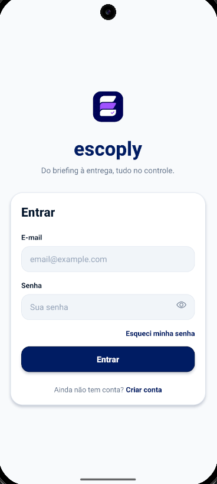
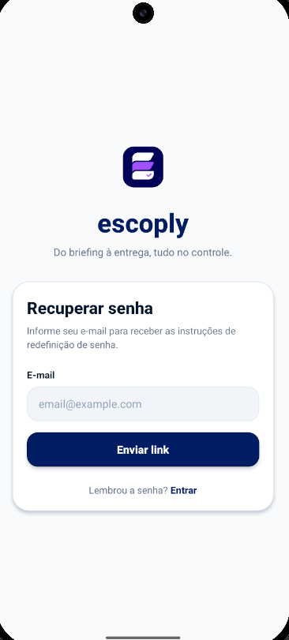
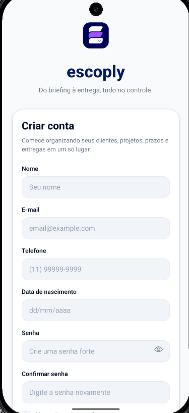

# Escoply

**Do briefing à entrega, tudo no controle.**

O Escoply é um aplicativo mobile criado para freelancers que precisam organizar clientes, projetos, escopos, orçamentos, aprovações, materiais, prazos e compromissos recorrentes sem depender de conversas espalhadas, planilhas soltas ou memória.

Ele nasce com uma proposta simples: transformar a rotina do freelancer em um fluxo claro, visual e fácil de acompanhar.

```txt
Cliente -> Projeto -> Escopo -> Orçamento -> Aprovação -> Entrega -> Pagamento
```

## Preview Do App

O Escoply é um produto mobile. Por isso, este projeto não disponibiliza um link web público de acesso. A experiência deve ser testada em emulador, dispositivo físico ou build Android/iOS.

As imagens abaixo devem ser screenshots reais do app:

| Login | Recuperar senha | Cadastro |
| --- | --- | --- |
|  |  |  |


## Por Que O Escoply Existe?

Freelancers lidam com várias frentes ao mesmo tempo:

- cliente pedindo orçamento;
- projeto em andamento;
- escopo aprovado parcialmente;
- material perdido em conversas;
- cobrança pendente;
- prazo chegando;
- entrega esperando aprovação;
- obrigação recorrente esquecida.

O Escoply organiza tudo isso em uma central única para que o profissional saiba o que precisa fazer, o que está pendente e o que já foi combinado com cada cliente.

## Proposta De Valor

Com o Escoply, o freelancer ganha:

- visão clara do dia de trabalho;
- histórico por cliente;
- controle de projetos em andamento;
- escopos documentados;
- orçamentos acompanháveis;
- aprovações registradas;
- lembretes importantes;
- menos retrabalho e menos informação perdida.

## Funcionalidades Planejadas

- Autenticação com login, cadastro e recuperação de senha.
- Cadastro de clientes.
- Cadastro de projetos.
- Checklist de escopo.
- Orçamentos por projeto.
- Aprovações importantes.
- Materiais e referências.
- Lembretes gerais e por projeto.
- Obrigações recorrentes.
- Pagamentos e valores a receber.
- Dashboard com visão geral do trabalho.

## Status Atual

Implementado:

- Estrutura base com Expo Router.
- Design inicial do fluxo de autenticação.
- Tela de login.
- Tela de cadastro com:
  - nome;
  - e-mail;
  - telefone;
  - data de nascimento;
  - idade mínima de 16 anos;
  - senha forte;
  - confirmação de senha;
  - aceite de termos de uso em bottom sheet.
- Tela de recuperação de senha.
- Toasts personalizados.
- Guia de padrão de projeto em `AGENTS.md`.

Em desenvolvimento:

- Integração com Supabase Auth.
- Persistência de sessão.
- Dashboard.
- Módulos de clientes e projetos.

## Stack

- Expo
- React Native
- TypeScript
- Expo Router
- NativeWind
- TanStack Query
- Supabase JS
- AsyncStorage
- Expo Vector Icons

## Back-end Planejado

O back-end será baseado em Supabase:

```txt
React Native -> Supabase Auth -> Postgres com RLS -> Storage
```

Uso previsto:

- Supabase Auth para autenticação.
- Postgres com RLS para dados por usuário.
- Storage para arquivos, materiais e anexos.
- Edge Functions apenas para ações sensíveis, webhooks, notificações e integrações externas.

## Estrutura Do Projeto

```txt
app/
  (auth)/
    login.tsx
    register.tsx
    forgot-password.tsx
  _layout.tsx
  index.tsx

src/
  components/
    feedback/
  features/
    auth/
      components/
  hooks/
  lib/
  providers/

constants/
  Colors.ts

docs/
  screenshots/
```

## Design

A interface segue uma direção visual limpa, moderna e objetiva:

- fundo claro;
- cards brancos;
- azul escuro como cor principal;
- bordas suaves;
- sombras discretas;
- formulários simples;
- feedback por toast;
- bottom sheets para ações contextuais;
- experiência mobile-first.

Paleta principal:

```txt
primary: #071E63
primaryDark: #041342
secondary: #8B5CF6
background: #F8FAFC
surface: #FFFFFF
surfaceMuted: #F1F5F9
text: #0F172A
textMuted: #64748B
border: #E2E8F0
success: #22C55E
warning: #F59E0B
danger: #EF4444
info: #3B82F6
```

## Como Rodar

Instale as dependências:

```bash
npm install
```

Inicie o Expo:

```bash
npx expo start
```

Com cache limpo:

```bash
npx expo start -c
```

Rodar no Android:

```bash
npx expo start --android
```

## Variáveis De Ambiente

```env
EXPO_PUBLIC_SUPABASE_URL=
EXPO_PUBLIC_SUPABASE_ANON_KEY=
EXPO_PUBLIC_API_URL=
```

## Build Development Android

```bash
npx eas build --profile development --platform android
```

Primeira configuração do EAS:

```bash
npx eas build:configure
```

## Verificações

TypeScript:

```bash
npx tsc --noEmit
```

Expo Doctor:

```bash
npx expo-doctor
```

## Roadmap

1. Conectar Supabase Auth.
2. Criar tabela `profiles`.
3. Implementar sessão persistente.
4. Criar navegação principal por tabs.
5. Implementar Dashboard.
6. Implementar Clientes.
7. Implementar Projetos.
8. Implementar Escopo.
9. Implementar Orçamentos.
10. Implementar Aprovações, Materiais, Lembretes e Pagamentos.

## Licença

Licença ainda não definida.
